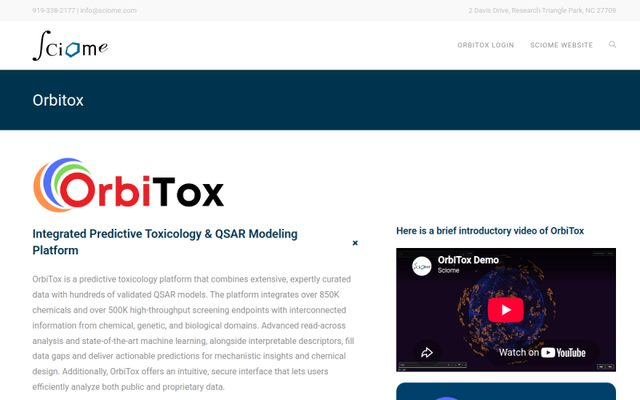
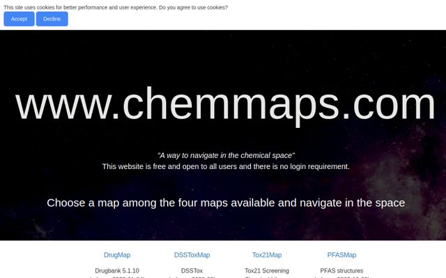
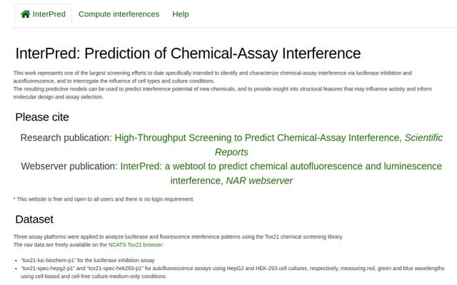
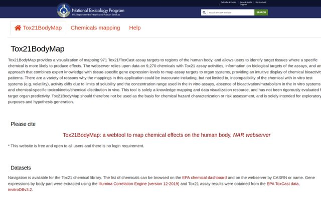
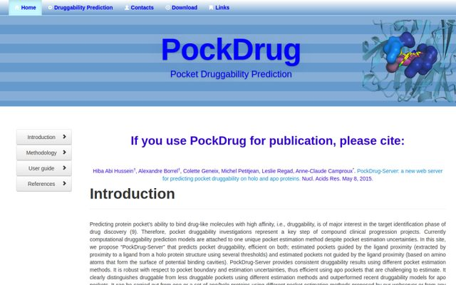

# Dr. Alexandre Borrel

**Alexandre (Alex) Borrel, Ph.D.**

[ORCID: 0000-0001-6499-4540](https://orcid.org/0000-0001-6499-4540)

[Google Scholar](https://scholar.google.com/scholar?q=author:%22Alexandre+Borrel%22) (h-index 16) 

28 peer-reviewed publications (11 first author)

email: a.borrel\[at\]gmail.com

[Download CV (PDF)](assets/resume_Aug2026_forweb.pdf)

A friendly, detail-oriented, and engaging team player and leader, adept at inspiring teams to achieve their best. A multi-tasking PhD-level Cheminformatician specializing in the application of modern AI, including deep learning and generative models, for toxicology. Possesses extensive expertise in QSAR modeling, analysis of high-throughput screening data, and the development of scientific software and web applications, complemented by strong project and team management capabilities.

## Developed and Maintained Web tools

  <a class="tool-card" href="https://orbitox.org/" target="_blank" rel="noopener">
    
    OrbiTox
  </a>
  <a class="tool-card" href="https://apps.sciome.com/chemmaps/" target="_blank" rel="noopener">
    
    ChemMaps
  </a>
  <a class="tool-card" href="https://apps.sciome.com/interferences/" target="_blank" rel="noopener">
    
    InterPred
  </a>
  <a class="tool-card" href="https://apps.sciome.com/bodymap/" target="_blank" rel="noopener">
    
    BodyMap
  </a>
  <a class="tool-card" href="https://pockdrug.rpbs.univ-paris-diderot.fr/cgi-bin/index.py?page=home" target="_blank" rel="noopener">
    
    PockDrug
  </a>

## Skills

  

    <h3>Data science &amp; AI/ML</h3>
    <ul>
      <li>Supervised and non-supervised modeling</li>
      <li>Imputation modeling</li>
      <li>Data visualization</li>
      <li>Agentic development</li>
      <li>Deep learning</li>
      <li>Feature engineering</li>
      <li>Machine learning</li>
    </ul>
  

  

    <h3>Programming and web development</h3>
    <ul>
      <li>Python (NumPy, scikit-learn, TensorFlow, …)</li>
      <li>R</li>
      <li>Ruby</li>
      <li>Full-stack development</li>
      <li>Database management (SQL, PostgreSQL)</li>
      <li>Django / Ruby on Rails</li>
    </ul>
  

  

    <h3>Management</h3>
    <ul>
      <li>Project Management</li>
      <li>Conflict resolution</li>
      <li>Leadership</li>
      <li>Problem solving</li>
      <li>Strategic planning</li>
      <li>Time management</li>
    </ul>
  

  

    <h3>Cheminformatics</h3>
    <ul>
      <li>Molecular dynamics (GROMACS, Schrödinger)</li>
      <li>Docking (Glide, AutoDock Vina)</li>
      <li>Computational high-throughput screening</li>
      <li>PBTK/PBPK</li>
      <li>Chemical space modeling</li>
      <li>QSAR modeling</li>
    </ul>
  

